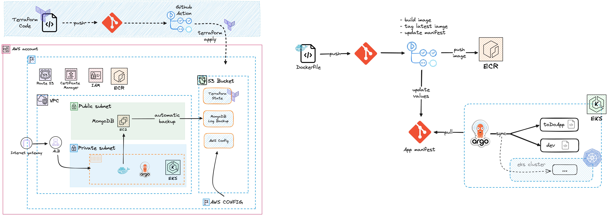

# poc-eks-argocd

## Env Setup

1. Deploy EKS infratructure within AWS
2. Deploy VPCs For the EKS Cluster
3. Deploy Managed Nodes (3)
4. Deploy EC2 - Install Mongdb
5. Container Web Application 
6. Configure the container as admin (https://kubernetes.io/docs/reference/access-authn-authz/rbac/)
7. Install argocd 
8. Enable AWS Config

Environment Information

1. Deploy in US-east-1 
2. Apply argocd kubectl apply -f 
3. kubectl get secret argocd-initial-admin-secret -n argocd -o jsonpath="{.data.password}" | base64 -d; echo
4. change argo cd creds 
4. argocd login <ARGOCD_SERVER> --username admin --password <PASSWORD>
5. argocd account update-password

Using mongosh:

switch to the admin database

add the myUserAdmin user with the userAdminAnyDatabase and readWriteAnyDatabase roles":

use admin
db.createUser(
  {
    user: "smaniak",
    pwd: "W3lcome098!",
    roles: [
      { role: "userAdminAnyDatabase", db: "admin" },
      { role: "readWriteAnyDatabase", db: "admin" }
    ]
  }
)

db.auth("smaniak", "W3lcome098!")

db.createUser({
  user: "adminSmaniak",
  pwd: "W3lcome098!",
  roles: [{ role: "dbAdmin", db: "toDoApp" }]
})

mongo -u "adminSmaniak" -p "W3lcome098!" --authenticationDatabase "toDoApp"

mongo -u admin -p W3lcome098! --authenticationDatabase admin

https://www.cherryservers.com/blog/install-mongodb-ubuntu-22-04

db.createUser(
  {
    user: "AdminCherry",
    pwd: passwordPrompt(),
    roles: [ { role: "userAdminAnyDatabase", db: "admin" }, "readWriteAnyDatabase" ]
 }
)
aws eks --region us-east-1 update-kubeconfig --name eks-maniak

This repository creates a VPC with private and public subnets and nat gateway with connection to internet gateway.

The EKS Version 1.29 is created on the created VPC , there is an option to switch between public and private(only within the vpc).

The Additional Supporting components Cluster AutoScaler,AWS Loadbalancer Controller and External DNS are also created by the repo as helm charts.

ArgoCD is created . there is an option to set the domain in the argocd.tf values this has to be set to the proper fqdn for argocd to function properly externally. additionally argocd needs an ingress to be defined to the same fqdn (host).

The terraform cleanly creates and destroys. If destroy fails for some reason, you need to just rerun destroy because eks cluster times out on deletion. There is an argocd-ingress.yaml under terraform folder for creating the argocd ingress(loadbalancer). It should be integrated in github actions. the manifest argocd-ingress.yaml should be applied via kubectl apply -f argocd-ingress.yaml after doing "aws eks update-kubeconfig --name --name us-east-2 "just after the terraform apply. also you need to kubectl delete the ingress before doing the terraform destroy . these can be done in github actions ci/cd

Get creds for argo cd kubectl get secret argocd-initial-admin-secret -n argocd -o jsonpath="{.data.password}" | base64 -d; echo